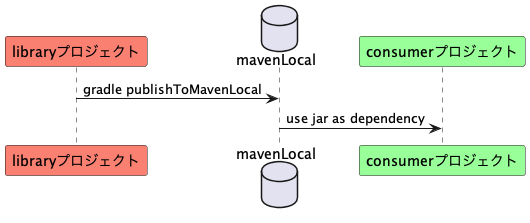
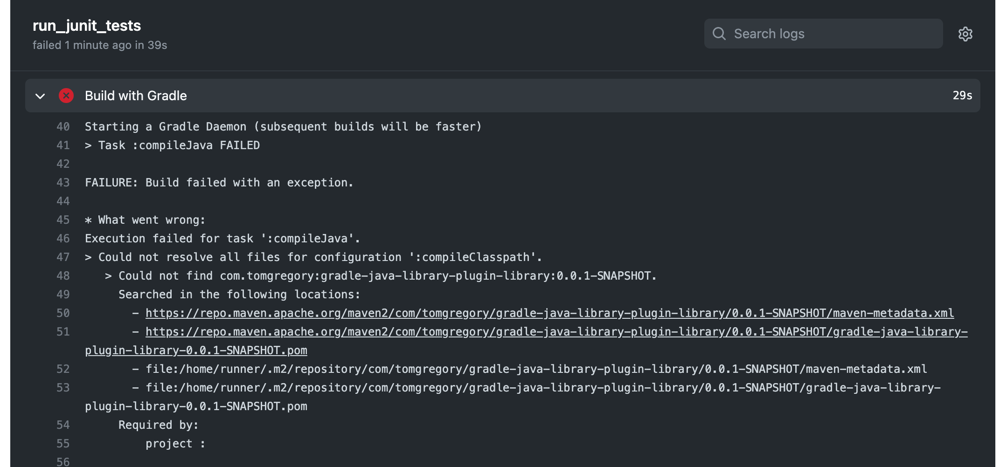

## 要旨

GitHubが公開している GitHub Packages registryにかんするドキュメント ["Working with the Gradle registry"](https://docs.github.com/en/packages/working-with-a-github-packages-registry/working-with-the-gradle-registry)に書いてある手順を適用してMavenレポジトリを作り、自作したプロジェクト２つがMavenレポジトリを介してjarファイルを受け渡しするという構成を作ることに成功した。プログラミング言語はJava、ビルドツールはGradle。事例として報告します。

## 解決したい問題

Java言語でビルドツールGradle使ったプロジェクトを２つ自作した。以下で、片方を「libraryプロジェクト」、もう一つを「consumerプロジェクト」と略記する。libraryプロジェクトの成果物としてjarファイルを生成し、consumerプロジェクトがそのjarファイルを参照する、という形だ。素材としたのはTom Gregoryの記事 ["How to use Gradle api vs. implementation dependencies"](https://tomgregory.com/how-to-use-gradle-api-vs-implementation-dependencies-with-the-java-library-plugin/)のサンプルコードほぼそのまま。

- https://github.com/kazurayam/gradle-java-library-plugin-library
- https://github.com/kazurayam/gradle-java-library-plugin-consumer

libraryプロジェクトはjarを生成して自PCのローカルディスク上にあるMavenレポジトリのキャッシュ（mavenLocalともいう）に保存する。consumerプロジェクトはmavenLocalにアクセスしてlibraryプロジェクトのjarを参照する。consumerプロジェクトのtestタスクを実行すれば成功した。

```
$ cd gradle-java-library-plugin-consumer
$ gradle test
Starting a Gradle Daemon (subsequent builds will be faster)

BUILD SUCCESSFUL in 9s
1 actionable task: 1 executed
```

内部では二つのプロジェクトは下図のような関係にある。




さて、わたしは某日、[GitHub Actions](https://docs.github.com/ja/actions/learn-github-actions/understanding-github-actions#create-an-example-workflow)を使って自動化テストを実践してみようと思った。CI環境つまりリモートマシン上で `gradle test` コマンドを実行する。具体的にはconsumerプロジェクトに下記ファイルを追加した。

- [.github/workflows/tests.yml](https://github.com/kazurayam/gradle-java-library-plugin-consumer/blob/develop/.github/workflows/tests.yml)

consumerプロジェクトのdevelopブランチをpushすればGitHub Actionsのワークフローで `gradle testが` 実行される。いざ実行したら失敗した。



なぜ失敗したのか？CI環境で起動されたconsumerプロジェクトのビルドがlibraryプロジェクトのjarを得ようとしてmavenLocalレポジトリを参照したが、空っぽだから、libraryプロジェクトのjarが見つからなかったから。mavenLocalを参照するのではダメだ。

一つの方法としてMaven Centralレポジトリにlibraryプロジェクトのjarをpublishするという方法も考えられるが、この方法は採用できない。自分が真剣に作ったプロジェクトを他人様と共有したいと望むならばMaven Centralに上げるのが良かろう。しかし学習ために作った軽いプロジェクトをMaven Centralに上げるべきではない。Maven Centralは表舞台だ、稽古場ではない。それにMaven Centralに向けてpublishすると、コマンドを実行してからサイトでjarが実際に公開されるまで二、三日も待たされる。待たされるからMaven Centralは学習の道具としては不適当だ。

結局、私はlibraryプロジェクトのために
mavenCentral、mavenLocal以外のMavenレポジトリを作り、consumerプロジェクトが第三のMavenレポジトリを参照する、という形を構築したい。

## 解決方法

GitHub Packagesを使って自作のJavaプロジェクトのためにMavenレポジトリをGradleで構築することができる。下記に公式ドキュメントがある。

- [GitHub Docs / Working with a GitHub Packages registry /Working with the Gradle registry](https://docs.github.com/ja/packages/working-with-a-github-packages-registry/working-with-the-gradle-registry)

## 説明

公式ドキュメントを読みながらわたしがやったことを以下にメモする。

### Personal Access Tokenを作る

### ~.gradle/gradle.properties を修正する

PATをGradleプロパティとして参照可能にする

### libraryプロジェクトのbuild.gradleを修正する

がjarをPackages上のMavenレポジトリにpublishするように設定する

### libraryプロジェクトでpublishコマンドを実行する

### consumerプロジェクトのbuild.gradleを修正する

がPackages上記ののMavenレポジトリからjarを参照するように設定する


## 結論


