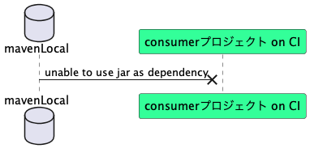
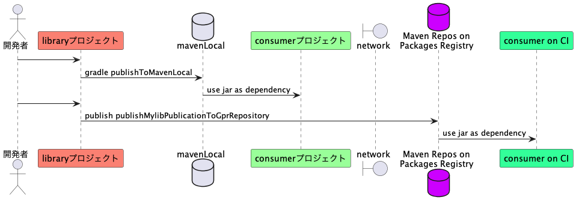

## 要旨

GitHubが公開している GitHub Packages registryにかんするドキュメント ["Working with the Gradle registry"](https://docs.github.com/en/packages/working-with-a-github-packages-registry/working-with-the-gradle-registry)に書いてある手順を適用してMavenレポジトリを作り、自作したプロジェクト２つがMavenレポジトリを介してjarファイルを受け渡しするという構成を作ることに成功した。プログラミング言語はJava、ビルドツールはGradle。事例として報告します。

## 解決したい問題

Java言語でビルドツールGradle使ったプロジェクトを２つ自作した。以下で、片方を「libraryプロジェクト」、もう一つを「consumerプロジェクト」と略記する。libraryプロジェクトの成果物としてjarファイルを生成し、consumerプロジェクトがそのjarファイルを参照する、という形だ。素材としたのはTom Gregoryの記事 ["How to use Gradle api vs. implementation dependencies"](https://tomgregory.com/how-to-use-gradle-api-vs-implementation-dependencies-with-the-java-library-plugin/)のサンプルコードほぼそのまま。

- https://github.com/kazurayam/gradle-java-library-plugin-library
- https://github.com/kazurayam/gradle-java-library-plugin-consumer

libraryプロジェクトはjarを生成して自PCのローカルディスク上にあるMavenレポジトリのローカルキャッシュ（mavenLocalともいう）に保存する。具体的には次のようなコマンドを実行する。

```
$ cd gradle-java-library-plugin-library
$ gradle publishToMavenLocal

BUILD SUCCESSFUL in 3s
5 actionable tasks: 5 executed
```

すると下記のようにjarファイルが出力された。

```
$ tree ~/.m2/repository/com/tomgregory/
/Users/kazurayam/.m2/repository/com/tomgregory/
└── gradle-java-library-plugin-library
    ├── 0.0.1-SNAPSHOT
    │   ├── gradle-java-library-plugin-library-0.0.1-SNAPSHOT.jar
    │   ├── gradle-java-library-plugin-library-0.0.1-SNAPSHOT.module
    │   ├── gradle-java-library-plugin-library-0.0.1-SNAPSHOT.pom
    │   └── maven-metadata-local.xml
    └── maven-metadata-local.xml

2 directories, 5 files
```

いっぽう consumerプロジェクトはmavenLocalにアクセスしてlibraryプロジェクトのjarを参照する。consumerプロジェクトのbuild.gradleにこう書いてあるからだ。

```
repositories {
  mavenLocal()
}
dependencies {
  implementation group: 'com.tomgregory',
      name: 'gradle-java-library-plugin-library',
      version: '0.0.1-SNAPSHOT'
}
```

consumerプロジェクトのtestタスクを実行すると成功した。つまりlibraryプロジェクトのjarファイルをconsumerプロジェクトが参照することができている。

```
$ cd gradle-java-library-plugin-consumer
$ gradle test
Starting a Gradle Daemon (subsequent builds will be faster)

BUILD SUCCESSFUL in 9s
1 actionable task: 1 executed
```

二つのプロジェクトは下図のような関係にある。


さて、わたしは某日、[GitHub Actions](https://docs.github.com/ja/actions/learn-github-actions/understanding-github-actions#create-an-example-workflow)を使って自動化テストを実践してみようと思った。CI環境つまりリモートマシン上で `gradle test` コマンドを実行する。具体的にはconsumerプロジェクトに下記ファイルを追加した。

- [.github/workflows/tests.yml](https://github.com/kazurayam/gradle-java-library-plugin-consumer/blob/0.1.1/.github/workflows/tests.yml)

consumerプロジェクトのdevelopブランチをpushしよう。するとGitHub Actionsのワークフローによりリモートのサーバー上で `gradle testが` 実行される。いざ実行したら失敗した。


なぜ失敗したのか？CI環境で起動されたconsumerプロジェクトのビルドがlibraryプロジェクトのjarを得ようとしてmavenLocalレポジトリを参照したが、空っぽなので、libraryプロジェクトのjarが見つからなかったからだ。この様子を図にすると次の通り。




解決の選択肢の一つとして、Maven Centralレポジトリにlibraryプロジェクトのjarをpublishするという方法も考えられる。しかしこの方法は採用できない。第一の理由はMaven Centralは表舞台であり稽古場ではないから。Maven Centralレポジトリには不特定多数のユーザがアクセスする。自分が真剣に作ったプロジェクトを彼らに提供したいと望むならMaven Centralに上げるのが良い。しかし個人的学習のために作ったゴミプロジェクトをMaven Centralに上げるべきではない。第二の理由は待たされるから。Maven Centralに向けて成果物をpublishするコマンドを実行してから、jarファイルがサイトで実際に公開されるまでに三・四日待たされる。

結局わたしはMaven Centralでもなくローカルキャッシュでもない第三のMavenレポジトリを作りそこにlibraryプロジェクトのjarをあげたい。そしてconsumerプロジェクトが第三のMavenレポジトリを参照するという形をとりたい。どうすればいいか？

## 解決方法

GitHub Packagesを使って自作のJavaプロジェクトのためにMavenレポジトリをGradleで構築することができる。下記に公式ドキュメントがある。

- [GitHub Docs / Working with a GitHub Packages registry /Working with the Gradle registry](https://docs.github.com/ja/packages/working-with-a-github-packages-registry/working-with-the-gradle-registry)

## 説明

下記のような構成を実現しよう。



子のために次の三つを実装する必要がある。

1. libraryプロジェクトにおいて開発者は２つのレポジトリに向けてjarをpublishする。第一にMavenローカルキャッシュ。第二にGitHub Packages Registryに構築したMavenレポジトリ。これを以下で「**GPRレポジトリ**」と略記する。
2. consumerプロジェクトのbuild.gradleはlibraryプロジェクトの成果物たるjarを２つのレポジトリを探索する。第一にMavenローカルキャッシュ。第二にGPRレポジトリ。jarが見つかりさえすればよくて、どちらでもかまわない。
3. GPRレポジトリにアクセスしようとAPIをcallすると、GitHubはPersonal Access Token(classic)による認証を要求する。libraryプロジェクトのGradleがGPRレポジトリに向けてjarをpublishするとき、実行時パラメータとして適切なUSERNAMEとKEYを宣言する必要がある。またconsumerプロジェクトのGradleがGPRレポジトリを参照する時にもやはりUSERNAMEとKEYを宣言する必要がある。

公式ドキュメントを読みながらわたしがやったことを以下にメモする。

### Personal Access Tokenを作る

### ~.gradle/gradle.properties を修正する

PATをGradleプロパティとして参照可能にする

### libraryプロジェクトのbuild.gradleを修正する

がjarをPackages上のMavenレポジトリにpublishするように設定する

### libraryプロジェクトでpublishコマンドを実行する

### consumerプロジェクトのbuild.gradleを修正する

がPackages上記ののMavenレポジトリからjarを参照するように設定する


## 結論


