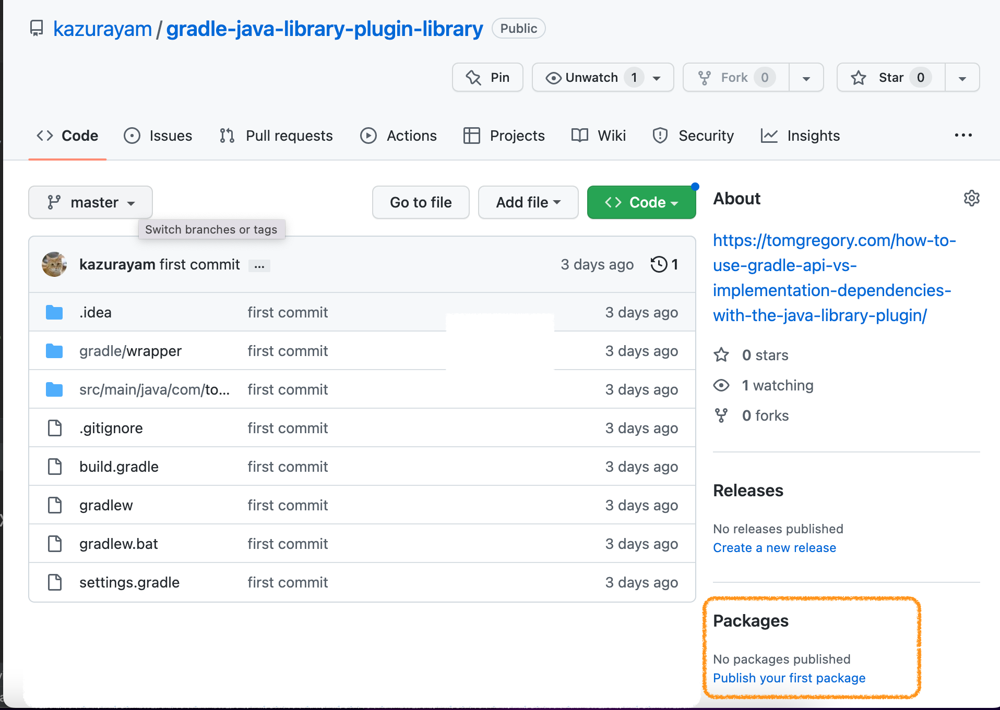

## 要旨

[GitHub Packages registry](https://docs.github.com/en/packages/working-with-a-github-packages-registry/working-with-the-gradle-registry)にMavenレポジトリを作り、自作プロジェクト二つがMavenレポジトリを介してjarファイルを受け渡しする構成を作った。プログラミング言語はJava、ビルドツールはGradle。事例として報告します。

## 解決したい問題

Java言語でビルドツールGradle使ったプロジェクトを２つ自作した。以下で、片方を「libraryプロジェクト」、もう一つを「consumerプロジェクト」と略記する。libraryプロジェクトの成果物としてjarファイルを生成し、consumerプロジェクトがそのjarファイルを参照する、という形だ。素材としたのはTom Gregoryの記事 ["How to use Gradle api vs. implementation dependencies"](https://tomgregory.com/how-to-use-gradle-api-vs-implementation-dependencies-with-the-java-library-plugin/)のサンプルコードほぼそのまま。

- https://github.com/kazurayam/gradle-java-library-plugin-library
- https://github.com/kazurayam/gradle-java-library-plugin-consumer

libraryプロジェクトはjarを生成して自PCのローカルディスク上にあるMavenレポジトリのローカルキャッシュ（mavenLocalともいう）に保存する。具体的には次のようなコマンドを実行する。

```
$ cd gradle-java-library-plugin-library
$ gradle publishToMavenLocal

BUILD SUCCESSFUL in 3s
5 actionable tasks: 5 executed
```

すると下記のようにjarファイルが出力された。

```
$ tree ~/.m2/repository/com/tomgregory/
/Users/kazurayam/.m2/repository/com/tomgregory/
└── gradle-java-library-plugin-library
    ├── 0.0.1-SNAPSHOT
    │   ├── gradle-java-library-plugin-library-0.0.1-SNAPSHOT.jar
    │   ├── gradle-java-library-plugin-library-0.0.1-SNAPSHOT.module
    │   ├── gradle-java-library-plugin-library-0.0.1-SNAPSHOT.pom
    │   └── maven-metadata-local.xml
    └── maven-metadata-local.xml

2 directories, 5 files
```

いっぽう consumerプロジェクトはmavenLocalにアクセスしてlibraryプロジェクトのjarを参照する。consumerプロジェクトのbuild.gradleにこう書いてある。

```
repositories {
  mavenLocal()
}
dependencies {
  implementation group: 'com.tomgregory', name: 'gradle-java-library-plugin-library', version: '0.0.1-SNAPSHOT'
}
```

consumerプロジェクトのtestタスクを実行すると成功した。つまりlibraryプロジェクトのjarファイルをconsumerプロジェクトが参照することができている。

```
$ cd gradle-java-library-plugin-consumer
$ gradle test
Starting a Gradle Daemon (subsequent builds will be faster)

BUILD SUCCESSFUL in 9s
1 actionable task: 1 executed
```

二つのプロジェクトは下図のような関係にある。


さて、わたしは某日、[GitHub Actions](https://docs.github.com/ja/actions/learn-github-actions/understanding-github-actions#create-an-example-workflow)を使って自動化テストを実践してみようと思った。CI環境つまりリモートマシン上で `gradle test` コマンドを実行する。具体的にはconsumerプロジェクトに下記ファイルを追加した。

- [.github/workflows/tests.yml](https://github.com/kazurayam/gradle-java-library-plugin-consumer/blob/0.1.1/.github/workflows/tests.yml)

consumerプロジェクトのdevelopブランチをGitHubへpushした。するとGitHub Actionsのワークフローによりリモートのサーバー上で `gradle test`コマンド が実行された。おっと、失敗した。


なぜ失敗したのか？CI環境で起動されたconsumerプロジェクトのビルドがlibraryプロジェクトのjarを得ようとしてmavenLocalレポジトリを参照したが、CIマシン上のmavenLocalは空っぽなので、libraryプロジェクトのjarが見つからなかったからだ。この様子を図にすると次の通り。


解決の選択肢の一つとして、Maven Centralレポジトリにlibraryプロジェクトのjarをpublishするという方法も考えられる。しかしこの方法は採用できない。第一の理由はMaven Centralは表舞台であり稽古場ではないから。Maven Centralレポジトリには不特定多数のユーザがアクセスする。自分が真剣に作ったプロジェクトを彼らに提供したいと望むならMaven Centralに上げるのが良い。しかし個人的学習のために作ったゴミプロジェクトをMaven Centralに上げるべきではない。第二の理由は長時間待たされるから。Maven Centralに向けて成果物をpublishする操作をわたしが実行すると即座にMaven Centrolの公式サイトにjarファイルが掲載
されるわけではない。どういう理由かは知らないが三・四日も待たされる。仕上がったソフトウェアをお披露目する段階ならいいけれど、開発作業の途中にこんなに待たされるのはたまらない。

結局わたしはMaven Centralでもなくローカルキャッシュでもない第三のMavenレポジトリを作りそこにlibraryプロジェクトのjarをあげたい。そしてconsumerプロジェクトが第三のMavenレポジトリを参照するという形をとりたい。どうすればいいか？

## 解決方法

GitHub Packagesを使って自作のJavaプロジェクトのためにMavenレポジトリをGradleで構築することができる。下記に公式ドキュメントがある。

- [GitHub Docs / Working with a GitHub Packages registry /Working with the Gradle registry](https://docs.github.com/ja/packages/working-with-a-github-packages-registry/working-with-the-gradle-registry)

だがそもそもGitHub Packagesって何？どこにあるモノのか？

libraryプロジェクトの[トップページ](https://github.com/kazurayam/gradle-java-library-plugin-library)を開いて、右サイドバーのちょっと下のほうを見ると **Packages** というタイトルが見つかる。*No packages published*と表示されている。わたしがまだPackageを作っていないから当然だ。



ここに **Packages 1** と表示されるようにしたい。これが達成すべき目標だ。

## 説明

下記のような構成を実現しよう。


これを実現するために次の三つを実装する必要がある。

1. libraryプロジェクトにおいて開発者は２つのレポジトリに向けてjarをpublishする。第一にMavenローカルキャッシュ。第二にGitHub Packages Registryに構築したMavenレポジトリ。これを以下で「**GPRレポジトリ**」と略記する。
2. consumerプロジェクトのbuild.gradleは２つのレポジトリを探ってlibraryプロジェクトのjarを発見する。第一にMavenローカルキャッシュ。第二にGPRレポジトリ。指定したnameとversionに合致するjarが見つかりさえすればよい。どちらのレポジトリからでもかまわない。
3. GradleがGPRレポジトリにアクセスしようとAPIをcallすると、GitHubは Personal Access Token(classic) による認証を要求する。libraryプロジェクトにおいてGradleがGPRレポジトリに向けてjarをpublishするとき、実行時パラメータとして適切なUSERNAMEとKEYを宣言する必要がある。またconsumerプロジェクトにおいてGradleがGPRレポジトリを参照する時にも適切なUSERNAMEとKEYを宣言する必要がある。だから準備としてPATを作り、PATをGradleに教える必要がある。

公式ドキュメントを読みながらわたしがやったことを以下にメモする。

### Personal Access Tokenを作る

Personal Access Token(以下、PATと略記する)の作り方についてはGitHubによる[公式ドキュメント](https://docs.github.com/ja/authentication/keeping-your-account-and-data-secure/creating-a-personal-access-token)を参照願います。わたしはPATを作って下記のように指定した。


`write:packages`をONしておく必要があるだろう。

### PATをGradleプロパティとして登録する

自分のPC上の `~/.gradle/gradle.properties` ファイルを下記のように手作業で修正した。

```
# Username and Key for GitHub Package
gpr.user=kazurayam
gpr.key=ghp_************************************
```

`******`のところに実際には皆さん各自のPersonal Access Tokenの値をここに書くべし。

自分のPC上で動くすべてのGradleプロジェクトにおいて `gpr.user` と `gpr.key` という名前のGradleプロパティが参照可能になる。つまりbuild.gradleファイルの中に次のように書いて `gradle build`を実行すればプロパティの値がprintされるだろう。

```
println "gpr.user=" + project.findProperty('gpr.user')
println "gpr.key =" + project.findProperty('gpr.key')
```

### libraryプロジェクトのbuild.gradleを修正する

libraryプロジェクトの[build.gradle]()ファイルを修正して、GPRレポジトリに向けてjarファイルをpublishできるようにした。

```

```


### libraryプロジェクトでpublishコマンドを実行する

### consumerプロジェクトのbuild.gradleを修正する

## 結論


