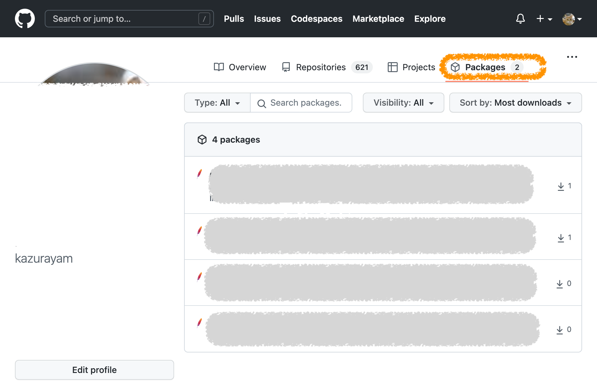
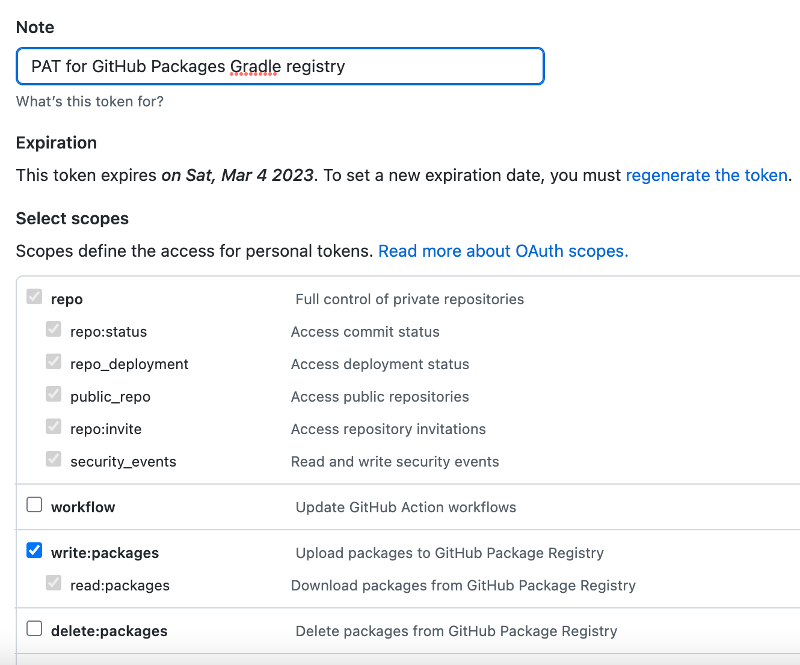
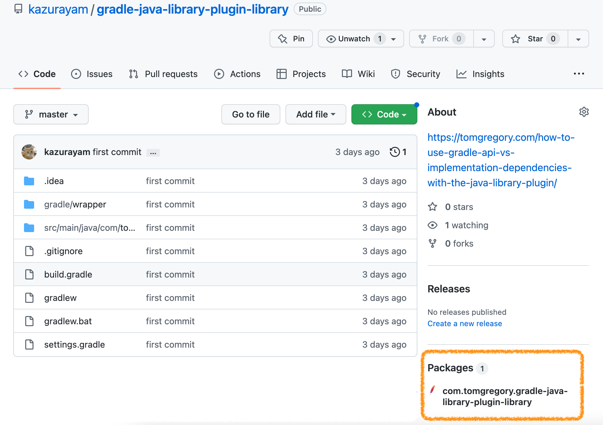
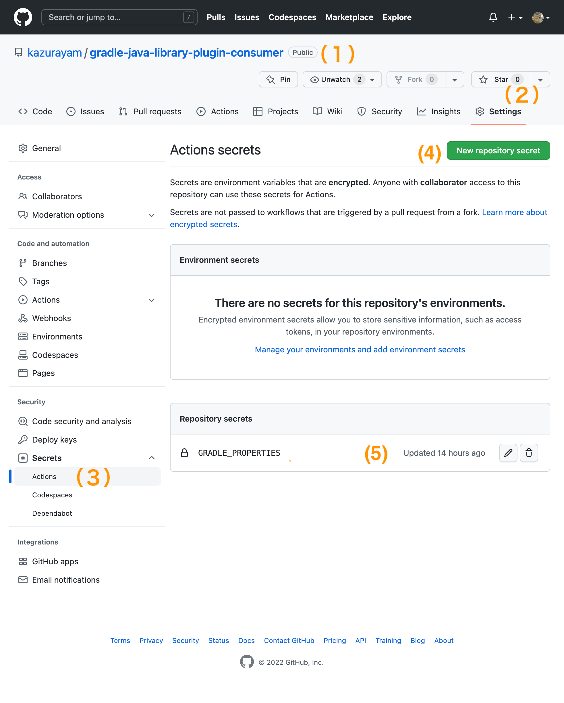

## 要旨

[GitHub Packages registry](https://docs.github.com/en/packages/working-with-a-github-packages-registry/working-with-the-gradle-registry)にMavenレポジトリを作り、自作プロジェクト二つがMavenレポジトリを介してjarファイルを受け渡しする構成を作った。プログラミング言語はJava、ビルドツールはGradle。事例として報告します。

## 解決したい問題

Java言語でビルドツールGradle使ったプロジェクトを２つ自作した。以下で、片方を「libraryプロジェクト」、もう一つを「consumerプロジェクト」と略記する。libraryプロジェクトの成果物としてjarファイルを生成し、consumerプロジェクトがそのjarファイルを参照する、という形だ。素材としたのはTom Gregoryの記事 ["How to use Gradle api vs. implementation dependencies"](https://tomgregory.com/how-to-use-gradle-api-vs-implementation-dependencies-with-the-java-library-plugin/)のサンプルコードほぼそのまま。

- https://github.com/kazurayam/gradle-java-library-plugin-library
- https://github.com/kazurayam/gradle-java-library-plugin-consumer

libraryプロジェクトはjarを生成して自PCのローカルディスク上にあるMavenレポジトリのローカルキャッシュ（mavenLocalともいう）に保存する。具体的には次のようなコマンドを実行する。

```
$ cd gradle-java-library-plugin-library
$ gradle publishToMavenLocal

BUILD SUCCESSFUL in 3s
5 actionable tasks: 5 executed
```

すると下記のようにjarファイルが出力された。

```
$ tree ~/.m2/repository/com/tomgregory/
/Users/kazurayam/.m2/repository/com/tomgregory/
└── gradle-java-library-plugin-library
    ├── 0.0.1-SNAPSHOT
    │   ├── gradle-java-library-plugin-library-0.0.1-SNAPSHOT.jar
    │   ├── gradle-java-library-plugin-library-0.0.1-SNAPSHOT.module
    │   ├── gradle-java-library-plugin-library-0.0.1-SNAPSHOT.pom
    │   └── maven-metadata-local.xml
    └── maven-metadata-local.xml

2 directories, 5 files
```

いっぽう consumerプロジェクトはmavenLocalにアクセスしてlibraryプロジェクトのjarを参照する。consumerプロジェクトのbuild.gradleにこう書いてある。

```
repositories {
  mavenLocal()
}
dependencies {
  implementation group: 'com.tomgregory', name: 'gradle-java-library-plugin-library', version: '0.0.1-SNAPSHOT'
}
```

consumerプロジェクトのtestタスクを実行すると成功した。つまりlibraryプロジェクトのjarファイルをconsumerプロジェクトが参照することができている。

```
$ cd gradle-java-library-plugin-consumer
$ gradle test
Starting a Gradle Daemon (subsequent builds will be faster)

BUILD SUCCESSFUL in 9s
1 actionable task: 1 executed
```

二つのプロジェクトは下図のような関係にある。


さて、わたしは某日、[GitHub Actions](https://docs.github.com/ja/actions/learn-github-actions/understanding-github-actions#create-an-example-workflow)を使って自動化テストを実践してみようと思った。CI環境つまりリモートマシン上で `gradle test` コマンドを実行する。具体的にはconsumerプロジェクトに下記ファイルを追加した。

- [.github/workflows/tests.yml](https://github.com/kazurayam/gradle-java-library-plugin-consumer/blob/0.1.1/.github/workflows/tests.yml)

consumerプロジェクトのdevelopブランチをGitHubへpushした。するとGitHub Actionsのワークフローによりリモートのサーバー上で `gradle test`コマンド が実行された。おっと、失敗した。


なぜ失敗したのか？CI環境で起動されたconsumerプロジェクトのビルドがlibraryプロジェクトのjarを得ようとしてmavenLocalレポジトリを参照したが、CIマシン上のmavenLocalは空っぽなので、libraryプロジェクトのjarが見つからなかったからだ。この様子を図にすると次の通り。


解決の選択肢の一つとして、Maven Centralレポジトリにlibraryプロジェクトのjarをpublishするという方法も考えられる。しかしこの方法は採用できない。第一の理由はMaven Centralは表舞台であり稽古場ではないから。Maven Centralレポジトリには不特定多数のユーザがアクセスする。自分が真剣に作ったプロジェクトを彼らに提供したいと望むならMaven Centralに上げるのが良い。しかし個人的学習のために作ったゴミプロジェクトをMaven Centralに上げるべきではない。第二の理由は長時間待たされるから。Maven Centralに向けて成果物をpublishする操作をわたしが実行すると即座にMaven Centrolの公式サイトにjarファイルが掲載
されるわけではない。どういう理由かは知らないが三・四日も待たされる。仕上がったソフトウェアをお披露目する段階ならいいけれど、開発作業の途中にこんなに待たされるのはたまらない。

結局わたしはMaven Centralでもなくローカルキャッシュでもない第三のMavenレポジトリを作りそこにlibraryプロジェクトのjarをあげたい。そしてconsumerプロジェクトが第三のMavenレポジトリを参照するという形をとりたい。どうすればいいか？

## 解決方法

GitHub Packagesを使って自作のJavaプロジェクトのためにMavenレポジトリをGradleで構築することができる。下記に公式ドキュメントがある。

- [GitHub Docs / Working with a GitHub Packages registry /Working with the Gradle registry](https://docs.github.com/ja/packages/working-with-a-github-packages-registry/working-with-the-gradle-registry)

だがそもそもGitHub Packagesって何？どこにあるモノのか？

自分のアカウントでGitHubにログインするとタブが並んでいる。`Overview` |  `Repositories` | `Projects` | `Packages`。この中の `Packages` タブをクリックすると現時点でわたしが持っているGitHub Packagesの一覧が見られる。こんなふうに。



>わたしのPackagesはどれもゴミなので詳細を伏せ字にしました。

GitHubが提供するサービス群の中で`Packages` は `Repositories` と同じレベルに位置付けられている。このことを理解しておきましょう。

次に個別のレポジトリに目を向けましょう。libraryプロジェクトの[レポジトリ gradle-java-library-plugin-library](https://github.com/kazurayam/gradle-java-library-plugin-library)を開いて、右サイドバーのちょっと下のほうを見ると **Packages** というタイトルが見つかる。*No packages published*と表示されている。


GitHubのレポジトリをPackage群とを画面で結びつけることで、便利なようにしているんだな。大多数のレポジトリはリンクするPackageを持たないが、たまに1個のPackageとリンクしているレポジトリがある。でも1個のレポジトリが2つ以上のPackageとリンクするってことは、あまりありそうにない。

gradle-java-library-plugin-libraryレポジトリのトップ画面のここに **Packages 1** と表示されるようにしたい。これがわたしの達成目標だ。

## 説明

下記のような構成を実現しよう。


これを実現するために次の三つを実装する必要がある。

1. libraryプロジェクトにおいて開発者は２つのレポジトリに向けてjarをpublishする。第一にMavenローカルキャッシュ。第二にGitHub Packages Registryに構築したMavenレポジトリ。これを以下で「**GPRレポジトリ**」と略記する。
2. consumerプロジェクトのbuild.gradleは２つのレポジトリを探ってlibraryプロジェクトのjarを発見する。第一にMavenローカルキャッシュ。第二にGPRレポジトリ。指定したnameとversionに合致するjarが見つかりさえすればよい。どちらのレポジトリからでもかまわない。
3. GradleがGPRレポジトリにアクセスしようとAPIをcallすると、GitHubは Personal Access Token(classic) による認証を要求する。libraryプロジェクトにおいてGradleがGPRレポジトリに向けてjarをpublishするとき、実行時パラメータとして適切なUSERNAMEとKEYを宣言する必要がある。またconsumerプロジェクトにおいてGradleがGPRレポジトリを参照する時にも適切なUSERNAMEとKEYを宣言する必要がある。だから準備としてPATを作り、PATをGradleに教える必要がある。

公式ドキュメントを読みながらわたしがやったことを以下にメモする。

### Personal Access Tokenを作る

Personal Access Token(以下、PATと略記する)の作り方についてはGitHubによる[公式ドキュメント](https://docs.github.com/ja/authentication/keeping-your-account-and-data-secure/creating-a-personal-access-token)を参照願います。わたしはPATを作って下記のように指定した。



`write:packages`をONしておく必要があるだろう。

### PATをGradleプロパティとして登録する

自分のPC上の `~/.gradle/gradle.properties` ファイルを下記のように手作業で修正した。

```
# Username and Key for GitHub Package
gpr.user=kazurayam
gpr.key=ghp_************************************
```

`******`のところに実際には皆さん各自のPersonal Access Tokenの値をここに書くべし。これで `gpr.user` と `gpr.key` という名前のGradleプロパティが自分のPC上で動くすべてのGradleプロジェクトにおいて参照可能になる。だからbuild.gradleファイルの中に次のように書いて `gradle build`を実行すればプロパティの値がprintされる。

```
println "gpr.user=" + project.findProperty('gpr.user')
println "gpr.key =" + project.findProperty('gpr.key')
```

こんなふうに

```
$ gradle build

> Configure project :
gpr.user=kazurayam
gpr.key =ghp_************************************

BUILD SUCCESSFUL in 1s
2 actionable tasks: 2 executed

```

### libraryプロジェクトのbuild.gradleを修正する

libraryプロジェクトの[build.gradle]()ファイルを修正して、GPRレポジトリに向けてjarファイルをpublishできるようにした。

```
publishing {
    repositories {
        maven {
            name = "gpr"
            url = uri("https://maven.pkg.github.com/kazurayam/gradle-java-library-plugin-library")
            credentials {
                username = project.findProperty("gpr.user") ?: System.getenv("GPR_USERNAME")
                password = project.findProperty("gpr.key") ?: System.getenv("GPR_TOKEN")
            }
        }
    }
    publications {
        mylib(MavenPublication) {
            from components.java
        }
    }
}
```

この記述が何をしているかというと次の二つだ。

1. `Mylib` という名前のpublicationを宣言している
2. `gpr` という名前のrepositoryを宣言している

なお`gpr`レポジトリに関する記述の中で

1. `url`の中にプロジェクトのownerつまり *GitHubアカウント名* と *プロジェクト名* が含まれる。

2. Personal Access Tokenの値をusernameとpasswordパラメータとして指定している

>なおここで指定するURLには注意を要する。 URLの中の *プロジェクト名* の部分に別のプロジェクトの名前をうっかり書いてしまうかもしれない。別のプロジェクトのbuild.gradleファイルから `repository` の記述をコピペすると、URLの中の *プロジェクト名* を書き換えるのをうっかり忘れてしまうかもしれない。実際わたしはこのミスをやらかした。publishコマンドを実行した時にエラーは発生しなかった。ただし本来あるべきGitHubレポジトリではなくて、間違えた別レポジトリの中にlibraryプロジェクトのPackageが作られてしまった。こういうミスをやらかしたせいで、あとで `Received status code 422 from server: Unprocessable Entity` というエラーメッセージに遭遇した。何が原因なのか分からなくて困った。


### libraryプロジェクトでpublishコマンドを実行する

libraryプロジェクトのjarを`gpr`レポジトリにpublishするタスクを実行した。

```
:~/github/gradle-java-library-plugin-library (master *)
$ gradle publishMylibPublicationToGprRepository

BUILD SUCCESSFUL in 19s
5 actionable tasks: 3 executed, 2 up-to-date

```

タスクの名前 `publishMylibPublicationToGprRepository` は build.gradleの中の `publishing` の記述に基づいて規則的に導き出されたものだ。つまり

`publish` + *publication名* + `PublicationTo` + *repositoryのname* + `Repository`

がタスク名になる。publication名とrepositoryのnameは自由に置き換えて構わない。ただしタスク名がそれを反映して別になることに注意のこと。

タスクを実行して成功した。libraryプロジェクトの[GitHubトップページ](https://github.com/kazurayam/gradle-java-library-plugin-library)を見たら、あら目出度や、**Packages 1**と表示された。Packageを作ることに成功した。



### consumerプロジェクトのbuild.gradleを修正する

さて、consumerプロジェクトのbuild.gradleファイルを修正して、gprレポジトリを参照するように設定しよう。

```
repositories {
    mavenCentral()
    maven {
        url = uri("https://maven.pkg.github.com/kazurayam/gradle-java-library-plugin-library")
        credentials {
            username = project.findProperty("gpr.user") ?: System.getenv("GPR_USERNAME")
            password = project.findProperty("gpr.key") ?: System.getenv("GPR_TOKEN")
        }
    }
    mavenLocal()
}
```

こんなふうにbuild.gradleファイルを修正してgit addしてgit commitしてgit pushした。GitHub Actionsで自動化テストが起動された。

ところがテストが失敗した。こういうメッセージが出力された。

```
> Task :compileJava FAILED

FAILURE: Build failed with an exception.

* What went wrong:
Execution failed for task ':compileJava'.
> Could not resolve all files for configuration ':compileClasspath'.
   > Could not resolve com.tomgregory:gradle-java-library-plugin-library:0.0.1.
     Required by:
         project :
      > Could not resolve com.tomgregory:gradle-java-library-plugin-library:0.0.1.
         > Could not get resource 'https://maven.pkg.github.com/kazurayam/gradle-java-library-plugin-library/com/tomgregory/gradle-java-library-plugin-library/0.0.1/gradle-java-library-plugin-library-0.0.1.pom'.
            > Username must not be null!
```

`Username must not be null!`というメッセージから次のように推測することができる。GitHub Actionsによってconsumerプロジェクトのbuild.gradleが動いた時にGradleプロパティ `gpr.user` と `gpr.key` が無いのだ。GitHub ActionsのワークフローがなんとかしてGradleプロパティ `gpr.user` と `gpr.key` を作って値を設定したい。どうすればいいか？

### CI環境に ~/.gradle/gradle.properties ファイルを復元する

consumerプロジェクトの [`.github/workflows/tests.yml`](https://github.com/kazurayam/gradle-java-library-plugin-consumer/blob/develop/.github/workflows/tests.yml)ファイルに次のような行を挿入した。

```
      - name: Restore gradle.properties
        env:
          GP: ${{ secrets.GRADLE_PROPERTIES }}
        shell: bash
        run: |
          mkdir -p ~/.gradle/
          echo "${GP}" > ~/.gradle/gradle.properties
```

このコードは ``${{ secrets.GRADLE_PROPERTIES }}`` が次のような文字列を返すことを期待している。

```
gpr.user=kazurayam
gpr.key=ghp_************************************
```

これはわたしが自分のPCで ~/.gradle/gradle.properties ファイルに書き込んだ2行と同じ。つまりGradleプロパティ `gpr.user` と `gpr.key` を宣言するための記述だ。

ワークフローに挿入したbashスクリプトはCIマシン上に `~/.gradle/gradle.properties`ファイルを新しく作る。その中に 変数参照 ``${{ secrets.GRADLE_PROPERTIES }}`` の内容をそのまま書き込む。つまりローカル環境で参照していた`gradle.properites`ファイルと同じ物をCI環境に再現するのだ。`gradle.properties`ファイルがCI環境で再現されれば `gradle test`タスクが動いた時、ローカル環境と同じように、Gradleプロパティ `gpr.user` と `gpr.key` が参照可能になり、`Username must not be null!`のエラーが解消するはずだ。

### echoコマンドにご注意を

ここで注意一つ。ワークフロー定義の中で `echo "${GRALDE_PROPERTIES}"` のように二重引用符合 " " で囲っている。" "を忘れると シェル変数 `GP` の値がこうなってしまう。
```
gpr.user=kazurayam gpr.key=ghp_************************************
```
" "が無いとechoコマンドが改行文字を空白文字に置換してしまうのだ。こうなるとGradleプロパティ `gpr.user` と `gpr.key` の値はおかしくなってしまう。そのせいで consumerプロジェクトのCIがlibraryプロジェクトのMavenレポジトリを参照しようとした時 `401 Unauthorized`　エラーが発生してしまう。

### Personal Access Tokenの値をGitHub Actions Secretsに格納してActionsワークフローに渡す

さて大詰めです。consumerプロジェクトのGitHub Actionワークフローは ``${{ secrets.GRADLE_PROPERTIES }}`` という記号を使って下記の文字列が参照できることを仮定しています。

```
gpr.user=kazurayam
gpr.key=ghp_************************************
```

では `secretes.GRADLE_PROPERTIES` をどうやって作り出せばいいのでしょうか？

*(答)* [GitHub Actions Secrets](https://docs.github.com/en/rest/actions/secrets)を使え

1. 自分のアカウントでGitHubにログインして、Secretを設定する対象となるレポジトリのページを開く。
2. `Settings`タブをクリック
3. 左サイドメニューの中で `Secrets` > `Actions` をクリック
4. `New repository secret`ボタンを押す

すると [/settings/secrets/secrets/actionsページ](https://github.com/kazurayam/gradle-java-library-plugin-consumer/settings/secrets/actions) に着地した。ここでわたしは 新しいsecret `GRADLE_REPOSITORIES` を作った。その内容は2行、前述したとおり。



`secrets.GRADLE_PROPERTIES`を設定したあと、consumerプロジェクトのworkflowを動かした。めでたくテストがpassした。

## 結論

[GitHub Docs / Working with a GitHub Packages registry /Working with the Gradle registry](https://docs.github.com/ja/packages/working-with-a-github-packages-registry/working-with-the-gradle-registry)を参考にしながら、自作の [libraryプロジェクト](https://github.com/kazurayam/gradle-java-library-plugin-library) のためにGitHub PackagesにMavenレポジトリを作った。ローカルPC上で `gradle publishMylibPublicationToGprRepositlry` コマンドを手動で実行することにより、GitHub Packages上のMaveレポジトリにjarファイルをpublishすることができた。また自作の [consumerプロジェクト](https://github.com/kazurayam/gradle-java-library-plugin-consumer)にGitHub Actionsワークフローによる自動化テストを実装し、libraryプロジェクトのMavenレポジトリを参照することに成功した。Packages上のレポジトリにはPersonal Access Tokenによる認証が必須であるが、それを通過するための実装上の問題点をクリアすることができた。

"GitHub Packages"というキーワードでネットを検索するとかなり多くの記事が見つかる。しかし今回わたしが試した方法を解説してくれる記事は見当たらなかった。Npm、Dockerコンテナの話が多くてMavenレポジトリの話がそもそも少ない。ビルドツールGradleを使う事例も少ない。またGitHub ActionsでPackageを作った的な記事が多くて、"gradle publishXXXXX” コマンドを手動実行してPackageを作ったというローテクな記事は皆無だった。

こんなやり方もあるんですよ。

